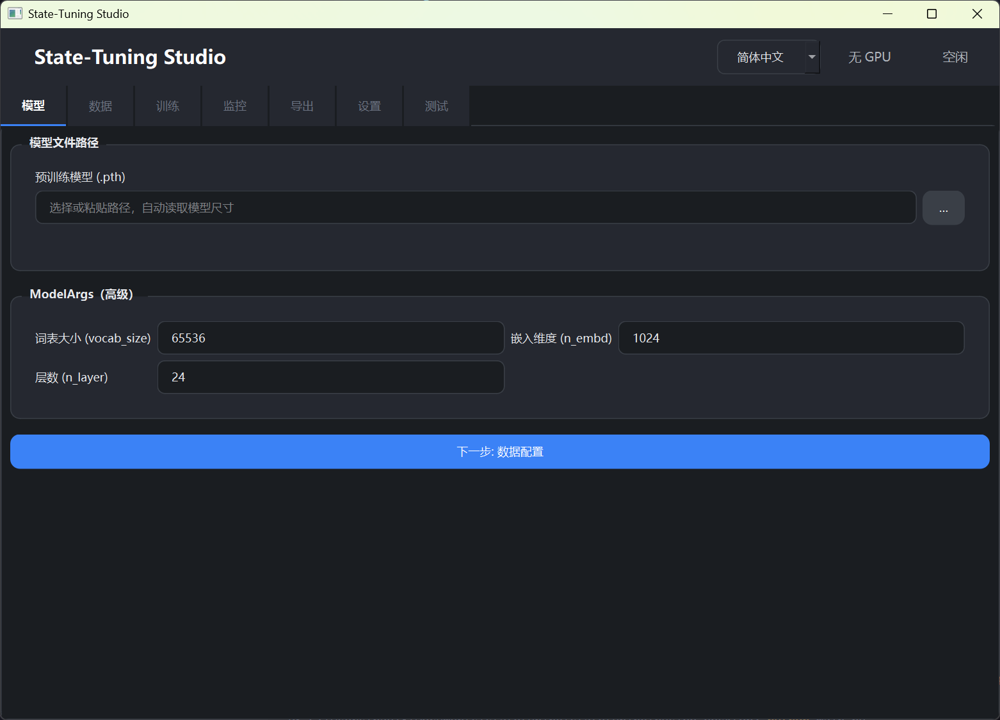
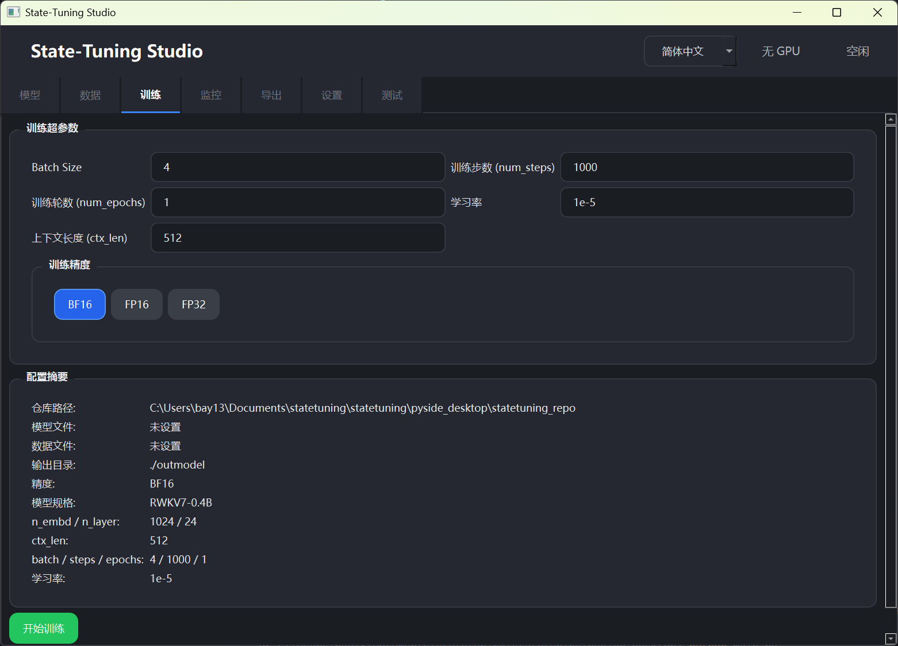
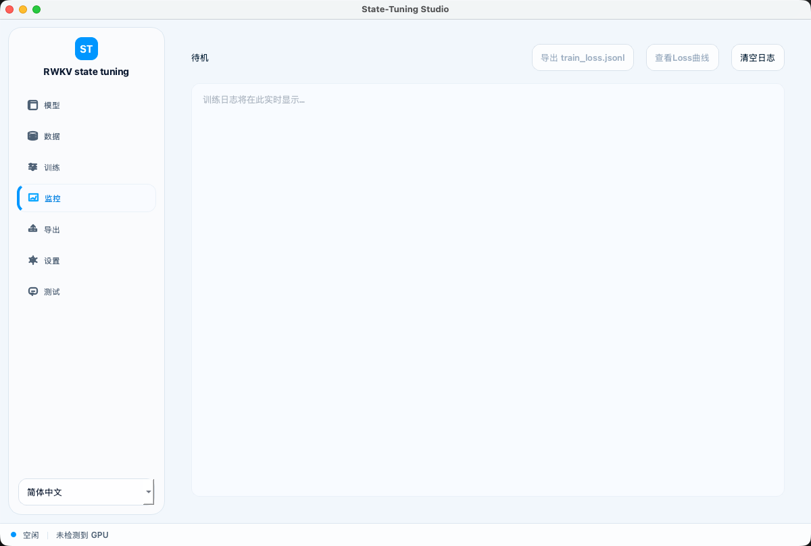
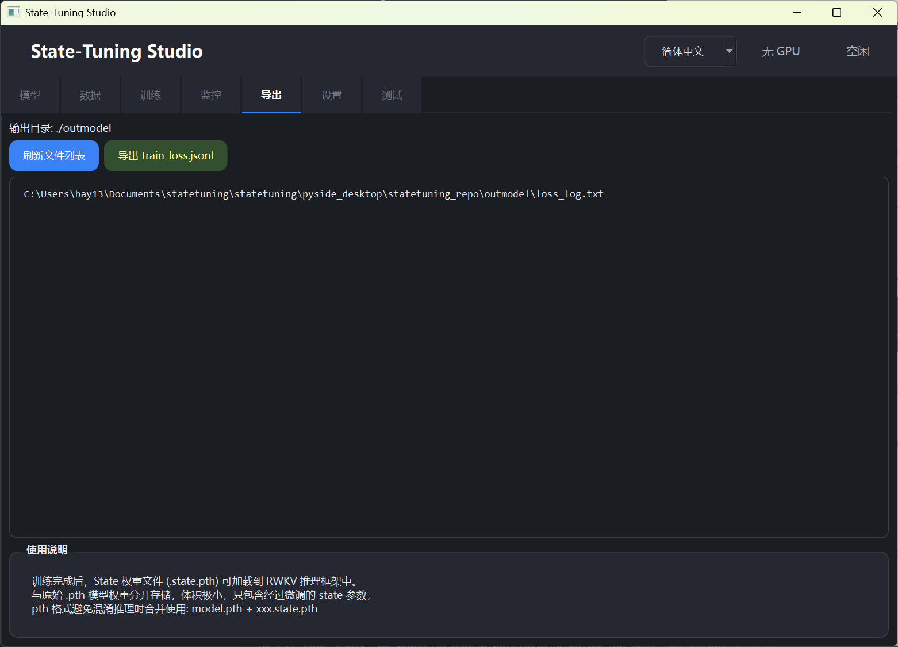
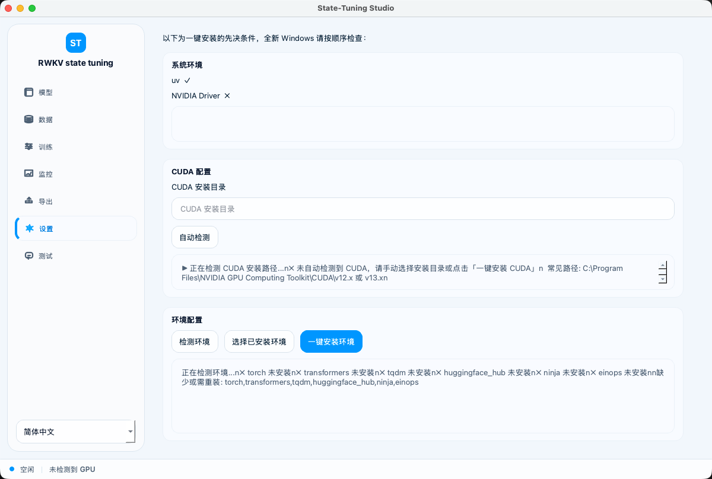
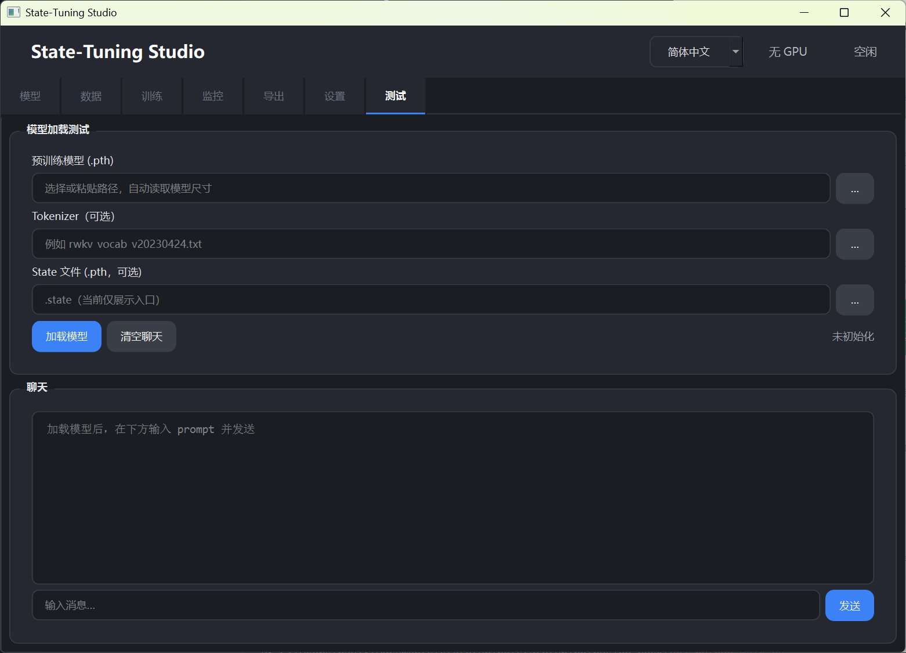

<div align="right">
  <strong>English</strong> | <a href="README.zh-CN.md">简体中文</a>
</div>

# State-Tuning Studio

A graphical tool for RWKV **State Tuning**. Configure models, prepare data, launch training, monitor progress, export weights, and test inference locally—all from one interface.

This repository includes **two clients** with broadly the same feature set. Choose the one that best fits your platform and workflow:

| Client | Location | Tech Stack | Best For |
|--------|----------|------------|----------|
| Flutter client | Project root (`lib/`, etc.) | Flutter / Dart | Desktop (Windows / Linux) |
| PySide desktop client | `pyside_desktop/` | Python / PySide6 | Native desktop apps for Windows / Linux |

The bundled training scripts are located in each client's `statetuning_repo/` directory and support RWKV7 State Tuning in bf16, fp16, and fp32 precision.

## Preview

<p align="center">
  
  
</p>
<p align="center">
  
  
</p>
<p align="center">
  
  
</p>
<p align="center">
  
</p>

## Features

- **Models**: Select pretrained `.pth` weights and a tokenizer
- **Data**: Manage the training repository and JSONL datasets
- **Training**: Configure hyperparameters and launch State Tuning
- **Monitoring**: View loss curves and training logs
- **Export**: Export trained state weights
- **Settings**: Detect or install the Python environment with one click, including PyTorch and other dependencies
- **Testing**: Load a model and run conversational inference tests

The interface supports **English / Simplified Chinese / Traditional Chinese**.

## Project Structure

```
statetuning/
├── lib/                    # Flutter application source
├── assets/                 # Flutter assets, including statetuning_repo.zip
├── android/ ios/ windows/ linux/   # Flutter platform projects
├── pyside_desktop/         # PySide desktop client
│   ├── main.py             # Desktop application entry point
│   ├── main_window.py      # Main window UI
│   ├── controller.py       # Application logic
│   ├── locale/             # Localized strings
│   └── statetuning_repo/   # Bundled training repository used by PySide
├── previewimg/             # Interface screenshots
└── README.md
```

---

## Run the Flutter Client

### Requirements

- [Flutter SDK](https://docs.flutter.dev/get-started/install) (Dart SDK ^3.8.1)
- Build tools for your target platform, such as Android Studio, Xcode, or Visual Studio
- The [`rwkv_mobile_flutter`](https://github.com/MollySophia/rwkv_mobile_flutter) plugin for model loading and inference on mobile devices

### Prepare Dependencies

By default, `pubspec.yaml` references `rwkv_mobile_flutter` through a local path:

```yaml
rwkv_mobile_flutter:
  path: ../../rwkv_mobile_flutter
```

Clone that repository next to `statetuning`, or update the `path` / `git` source in `pubspec.yaml`.

Example directory layout:

```
Documents/
├── rwkv_mobile_flutter/
└── statetuning/statetuning/   # Root of this Flutter project
```

### Launch

Run the following commands from the project root containing `pubspec.yaml`:

```bash
flutter pub get
flutter run
```

To target a specific device:

```bash
# Windows desktop
flutter run -d windows

# Linux desktop
flutter run -d linux

# Android device or emulator
flutter run -d android
```

On first launch, the app extracts and initializes the bundled training repository. Use the **Settings** page to detect or install the Python training environment.

---

## Run the PySide Desktop Client

### Requirements

- Python 3.10+ (3.11 or 3.12 recommended)
- Optional: an NVIDIA GPU with CUDA for training and GPU inference
- On Windows, compiling CUDA operators may require **Visual Studio Build Tools**; the app can detect this requirement and guide you through installation

### Launch

**Option 1: Launch from the project root (recommended)**

```bash
cd /path/to/statetuning
python -m pyside_desktop.main
```

**Option 2: Launch from the `pyside_desktop` directory**

```bash
cd pyside_desktop
python main.py
# or
python -m main
```

If PySide6 is not installed, the launcher automatically creates a virtual environment at `pyside_desktop/.venv` and installs the dependencies without modifying the system Python installation. It retries the default package index and common mirrors automatically. You can also set `PIP_INDEX_URL` to use a custom mirror.

### First-Time Setup

1. Open **Settings**, then select **Detect Environment** or **One-Click Install** to create `python_venv` and install PyTorch and other dependencies.
2. Alternatively, select **Choose Existing Environment** and provide a Python virtual environment directory. If the directory is empty, the dependencies are installed there automatically.
3. Once the environment is ready, follow the workflow through the **Models**, **Data**, and **Training** pages.

The PySide client's **Testing** page loads models and generates text through a separate Python subprocess (`_pyside_rwkv_test_worker.py`), so it does not require the Flutter plugin.

---

## Training Repository

Each client includes a `statetuning_repo/` directory containing the RWKV State Tuning scripts. See the following files for detailed parameter documentation:

- Flutter client after extraction: `assets/statetuning_repo/README.md`
- PySide client: `pyside_desktop/statetuning_repo/README.md`

You can also run training directly from the command line after configuring the Python environment and the parameters in `train.py`:

```bash
cd pyside_desktop/statetuning_repo
python train.py
```

## Choosing a Client

| | Flutter Client | PySide Desktop Client |
|---|----------------|-----------------------|
| Mobile | ✅ Android / iOS | ❌ |
| Desktop | ✅ Windows / Linux, etc. | ✅ Windows / Linux |
| Model testing backend | `rwkv_mobile_flutter` plugin | Python + PyTorch subprocess |
| Environment setup | Guided setup in the app | One-click setup in the app with uv / pip support |
| Dependencies | Flutter SDK + rwkv_mobile_flutter | Python 3 + PySide6 (automatic installation available) |

## License

See the `LICENSE` file in this repository.
