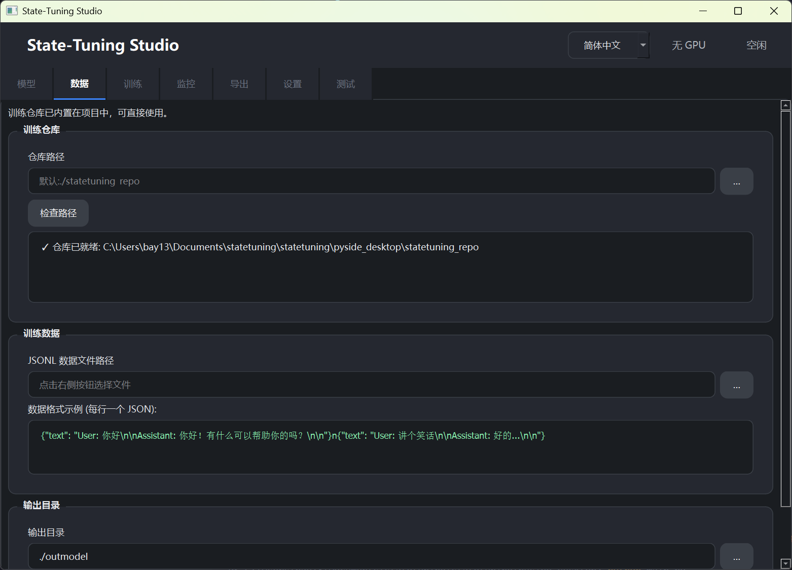
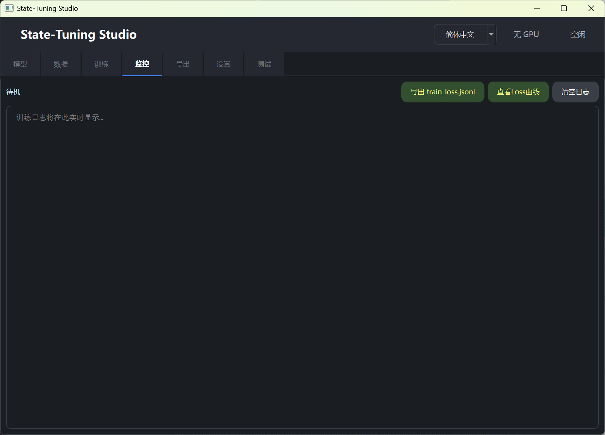
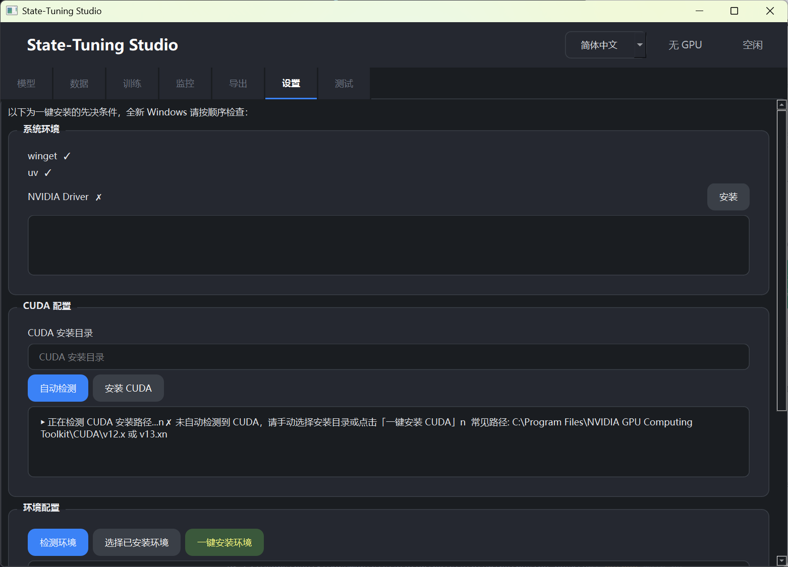

# State-Tuning Studio

RWKV **State Tuning** 的可视化工具，用于配置模型、准备数据、启动训练、监控进度、导出权重，并在本地测试推理效果。

本仓库包含 **两套客户端**，功能基本一致，可按平台与使用习惯选择：

| 客户端 | 目录 | 技术栈 | 适用场景 |
|--------|------|--------|----------|
| Flutter 版 | 项目根目录（`lib/` 等） | Flutter / Dart | 移动端（Android / iOS）及桌面端（Windows / Linux 等） |
| PySide 桌面版 | `pyside_desktop/` | Python / PySide6 | Windows / Linux 原生桌面应用 |

内置训练脚本位于各客户端自带的 `statetuning_repo/` 目录中，支持 bf16 / fp16 / fp32 精度的 RWKV7 State Tuning 训练。

## 预览

<p align="center">
  
  
</p>
<p align="center">
  
  
</p>
<p align="center">
  
  
</p>
<p align="center">
  
</p>

## 主要功能

- **模型**：选择预训练 `.pth` 权重与 tokenizer
- **数据**：管理训练仓库与 JSONL 数据集
- **训练**：配置超参数并启动 State Tuning
- **监控**：查看 loss 曲线与训练日志
- **导出**：导出训练后的 state 权重
- **设置**：检测 / 一键安装 Python 环境（PyTorch、依赖包等）
- **测试**：加载模型并进行对话式推理测试

支持 **English / 简体中文 / 繁體中文** 界面切换。

## 项目结构

```
statetuning/
├── lib/                    # Flutter 应用源码
├── assets/                 # Flutter 资源（含 statetuning_repo.zip）
├── android/ ios/ windows/ linux/   # Flutter 各平台工程
├── pyside_desktop/         # PySide 桌面版
│   ├── main.py             # 桌面版入口
│   ├── main_window.py      # 主窗口 UI
│   ├── controller.py       # 业务逻辑
│   ├── locale/             # 多语言文案
│   └── statetuning_repo/   # 内置训练仓库（PySide 版直接使用）
├── previewimg/             # 界面预览截图
└── README.md
```

---

## 运行 Flutter 版

### 环境要求

- [Flutter SDK](https://docs.flutter.dev/get-started/install)（Dart SDK ^3.8.1）
- 对应平台的构建工具（如 Android Studio、Xcode、Visual Studio 等）
- 依赖插件 [`rwkv_mobile_flutter`](https://github.com/MollySophia/rwkv_mobile_flutter)（用于移动端模型加载与推理）

### 准备依赖

`pubspec.yaml` 中默认通过本地路径引用 `rwkv_mobile_flutter`：

```yaml
rwkv_mobile_flutter:
  path: ../../rwkv_mobile_flutter
```

请将该仓库克隆到与 `statetuning` 同级的目录，或修改 `pubspec.yaml` 中的 `path` / `git` 地址。

目录示例：

```
Documents/
├── rwkv_mobile_flutter/
└── statetuning/statetuning/   # 本仓库 Flutter 工程根目录
```

### 启动

在项目根目录（含 `pubspec.yaml` 的目录）执行：

```bash
flutter pub get
flutter run
```

指定设备示例：

```bash
# Windows 桌面
flutter run -d windows

# Linux 桌面
flutter run -d linux

# Android 设备 / 模拟器
flutter run -d android
```

首次运行会在应用内解压并初始化内置训练仓库；可在 **设置** 页检测并安装 Python 训练环境。

---

## 运行 PySide 桌面版

### 环境要求

- Python 3.10+（推荐 3.11 或 3.12）
- 可选：NVIDIA GPU + CUDA（用于训练与 GPU 推理）
- Windows 上训练 CUDA 算子时可能需要 **Visual Studio Build Tools**（应用内可检测并引导安装）

### 启动

**方式一：从项目根目录启动（推荐）**

```bash
cd /path/to/statetuning
python -m pyside_desktop.main
```

**方式二：进入 `pyside_desktop` 目录启动**

```bash
cd pyside_desktop
python main.py
# 或
python -m main
```

若未安装 PySide6，程序会自动执行 `pip install -r pyside_desktop/requirements.txt` 进行安装。

### 首次使用

1. 打开 **设置** 页，点击 **检测环境** 或 **一键安装**，自动创建 `python_venv` 并安装 PyTorch 等依赖。
2. 也可点击 **选择已有环境**，指定已有的 Python 虚拟环境目录；若目录为空则会自动在该路径下安装。
3. 环境就绪后，在 **模型 / 数据 / 训练** 等页面按流程操作即可。

PySide 版的 **测试** 页通过独立 Python 子进程（`_pyside_rwkv_test_worker.py`）加载模型并生成文本，无需 Flutter 插件。

---

## 训练仓库说明

各客户端内置的 `statetuning_repo/` 为 RWKV State Tuning 训练脚本，详细参数说明见：

- Flutter 解压后：`assets/statetuning_repo/README.md`
- PySide 版：`pyside_desktop/statetuning_repo/README.md`

也可在命令行直接运行训练（需先配置好 Python 环境与 `train.py` 参数）：

```bash
cd pyside_desktop/statetuning_repo
python train.py
```

## 两个版本如何选择

| | Flutter 版 | PySide 桌面版 |
|---|-----------|--------------|
| 移动端 | ✅ Android / iOS | ❌ |
| 桌面端 | ✅ Windows / Linux 等 | ✅ Windows / Linux |
| 模型测试后端 | `rwkv_mobile_flutter` 插件 | Python + PyTorch 子进程 |
| 环境安装 | 应用内引导 | 应用内一键安装，支持 uv / pip |
| 依赖 | Flutter SDK + rwkv_mobile_flutter | Python 3 + PySide6（可自动安装） |

## 许可证

请参阅仓库中的 LICENSE 文件（如有）。
